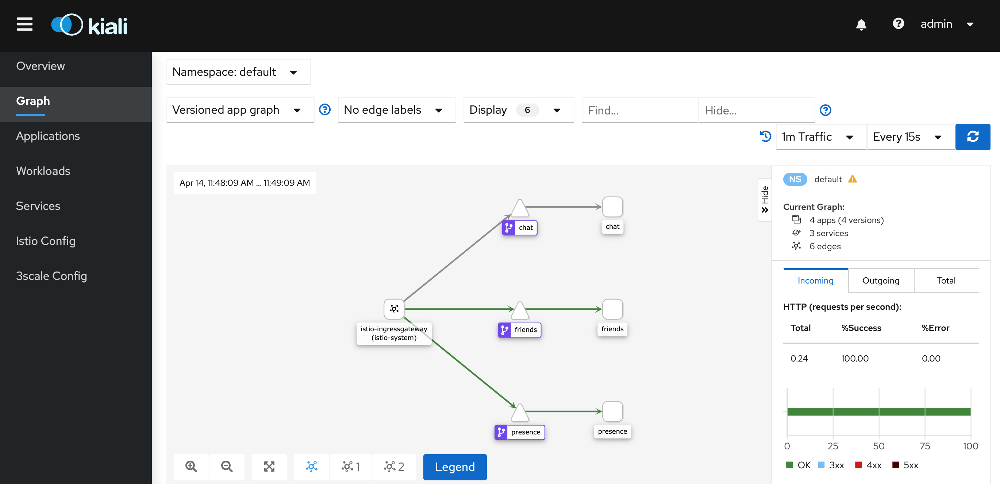

# CloudState java-chat sample application

This is a sample application demoing using CloudState to build a chat application in Java.

It supports 2 features - user presence and user's friends

The application has two components, 
presence stateful function, which uses a vote CRDT to store whether a user is currently online or not, 
and friends stateful function, which uses a ORSet CRDT to store a list of user's friends. 
It also relies on a chat application, that serves a UI. 

The UI is designed to allow connecting as multiple users in one browser window, this is for demonstration purposes, to make it straight forward to see real time interactions, serverside pushes etc, without needing to open many browser tabs.

## Running in Kubernetes

To run in Kubernetes on GCP, you need create a cluster and install Istio version 1.4.6 
To do this I was following approach outlined in this [blog post](https://medium.com/google-cloud/how-to-properly-install-knative-on-gke-f39a1274cd4f)
(without Knative). The actual script is copied from [here](https://github.com/meteatamel/knative-tutorial/tree/master/setup)

Create cluster
````
deploy/cluster/create-gke-cluster
````
Install Istio. Istio release 1.4.7 is [here](https://github.com/istio/istio/releases/tag/1.4.7).
Go to the Istio directory and run following command:
````
bin/istioctl manifest apply --set profile=default
````
To add Kiali and grafana run:

````
bin/istioctl manifest apply --set values.grafana.enabled=true --set values.kiali.enabled=true
````
If you can't access Kiali, run the [following](https://github.com/rootsongjc/cloud-native-sandbox/issues/2):
````
kubectl create secret generic kiali -n istio-system --from-literal=username=admin --from-literal=passphrase=admin
````

Add a namespace label to instruct Istio to automatically inject Envoy sidecar proxies when you deploy your application
````
kubectl label namespace default istio-injection=enabled
````

To install CloudState, run the following:

````
kubectl create namespace cloudstate
kubectl apply -n cloudstate -f https://raw.githubusercontent.com/cloudstateio/cloudstate/master/operator/cloudstate.yaml
````

Now, you can install the chat, friends and presence services by running the following:

````
kubectl apply -f /Users/boris/Projects/samples-java-chat/deploy/chat.yaml
kubectl apply -f /Users/boris/Projects/samples-java-chat/deploy/friends.yaml
kubectl apply -f /Users/boris/Projects/samples-java-chat/deploy/presence.yaml
````

install Istio virtual services

````
kubectl apply -f /Users/boris/Projects/samples-java-chat/deploy/chatVirtualService.yaml
````

You may wish to scale the presence service up, to see that it works on multiple nodes:

```
kubectl scale deploy/presence-deployment --replicas 3
kubectl scale deploy/friends-deployment --replicas 3
```
Run 
````
kubectl get svc istio-ingressgateway -n istio-system
````
to get external IP

Go to `http://<externalIP>/pages/chat.html` and enjoy the show

To access Kiali first install a virtual service
````
kubectl apply -f /Users/boris/Projects/samples-java-chat/deploy/kialiVirtualService.yaml
````
You should see something like this:
